# Tutorial para Instalar un Servidor DHCP en Debian mediante el uso de la terminal
<br><br>

>En este documento se indica por pasos como configurar un servidor DHCP en un Sistema Operativo Debian. En primer lugar redacté todo el tutorial ayudandome del material online que dispongo. Luego en base a eso he realizado un ejemplo práctico documentandolo con imagenes. Dichas imagenes son las que se pueden ver en cada paso debajo, siendo de gran ayuda para mejorar el propio tutorial.

<br><br>

# Índice
* [Pasos previos](#pasos-previos)
* [1. Actualizar sistema](#paso-1-actualizar-el-sistema)
* [2. Instalación](#paso-2-instalar-el-servidor-dhcp)
* [3. Configuración](#paso-3-configurar-el-servidor-dhcp)
* [4. Habilitar el servicio](#paso-4-habilitar-el-servidor-dhcp)
* [5. Iniciar el servicio](#paso-5-iniciar-el-servidor-dhcp)
* [6. Verificar el estado](#paso-6-verificar-el-estado-del-servidor-dhcp)
* [7. Firewall](#paso-7-configurar-tu-enrutador-o-firewall)

<br><br>
<br><br>

## _Pasos previos_:
---
1. La red que voy a usar es la `192.168.5.0/24`.  
Tengo un router PfSense con IP 192.168.5.1.  
Quiero poner el servidor DHCP en la 192.168.5.5.

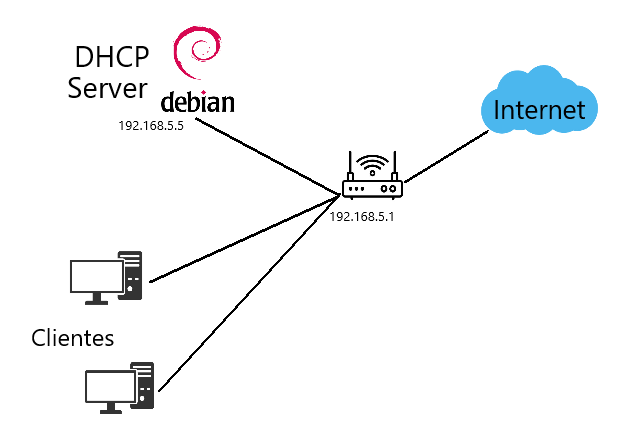

2. Para poder empezar lo primero que tengo que hacer es comprobar en VirtualBox que esten en la misma red Interna que el resto de maquinas que seran clientes.

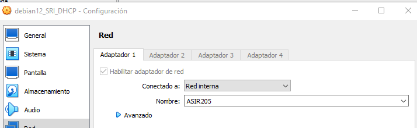


3. Es muy importante tambien poner una IP estática al Debian que usaré para DHCP.

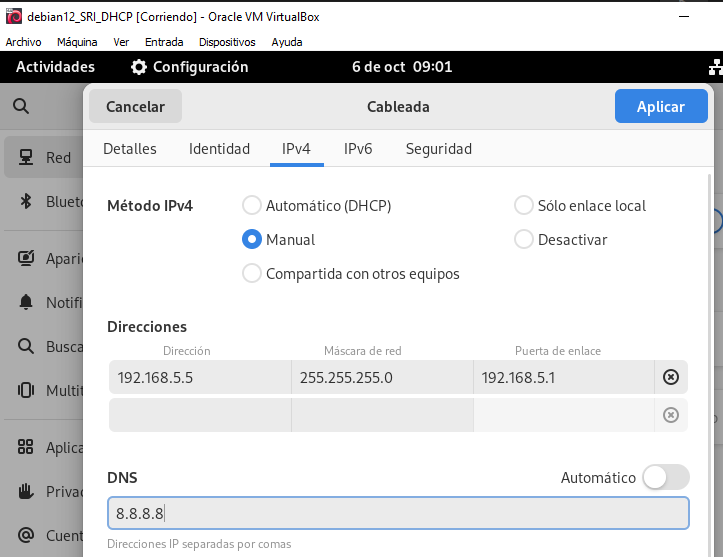

<br><br>

## **Paso 1: Actualizar el sistema**
---
Para que no haya errores inesperados y todo funcione bien, es conveniente asegurarse que las actualizaciones estan al día.
```
sudo apt update
sudo apt upgrade
```
* Update:

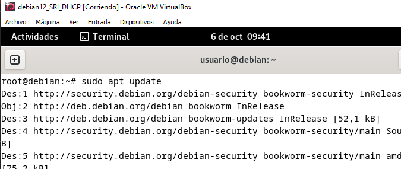

* Upgrade:

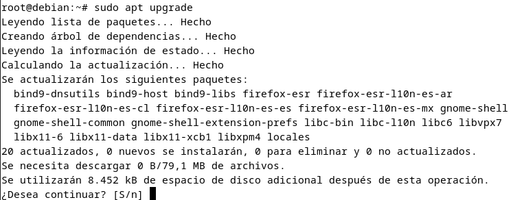

<br><br>

## **Paso 2: Instalar el servidor DHCP**
---
Para instalar el servicio DHCP, utilizo el siguiente comando:

```
sudo apt install isc-dhcp-server
```

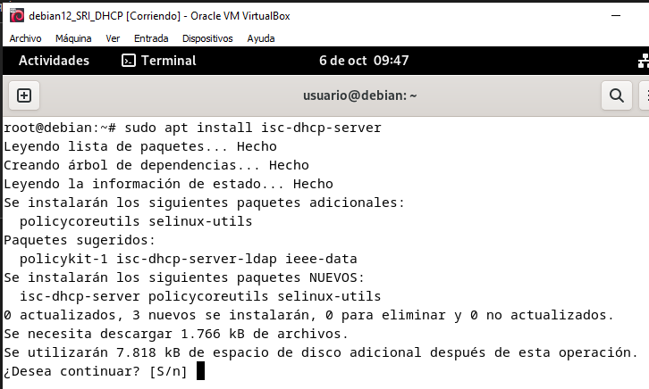

 >Puede que de un error al final de la instalación, porque intentará iniciar el servicio pero al no tenerlo configurado, puede dar fallo. No quiere decir que no se haya instalado bien.

<br><br>

## **Paso 3: Configurar el servidor DHCP**
---
Antes de empezar a configurar el rango de direcciones y demas, voy a indicar la interfaz de red en la que el servidor DHCP funcionará. Esto lo tengo que hacer en el fichero `/etc/default/isc-dchp-server`.
```
sudo nano /etc/default/isc-dchp-server
```
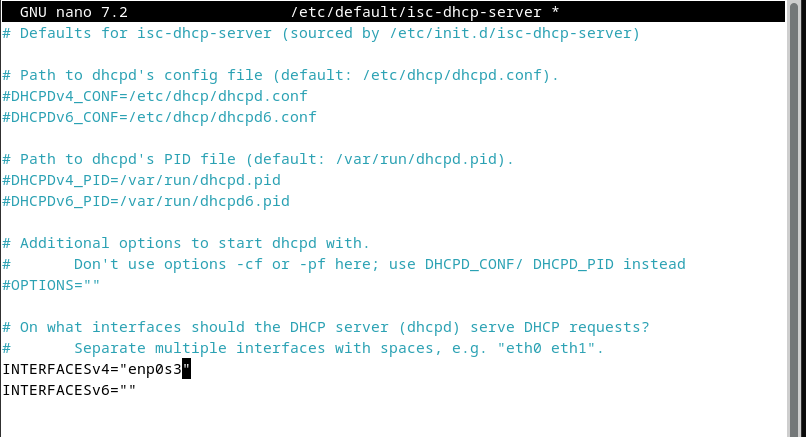

Escojo la interfaz que tiene mi red local (enp0s3). 

<br><br>

El archivo principal de configuración para el servidor DHCP en Debian es `/etc/dhcp/dhcpd.conf`.

```
sudo nano /etc/dhcp/dhcpd.conf
```
Dentro de este archivo configuro los rangos de direcciones IP que voy a asignar a los clientes DHCP y las opciones de red. Un ejemplo básico de configuración:

```
subnet 192.168.1.0 netmask 255.255.255.0 {
  range 192.168.1.10 192.168.1.150;
  option routers 192.168.1.1;
  option domain-name-servers 8.8.8.8;
}
```
Así me ha quedado configurado:

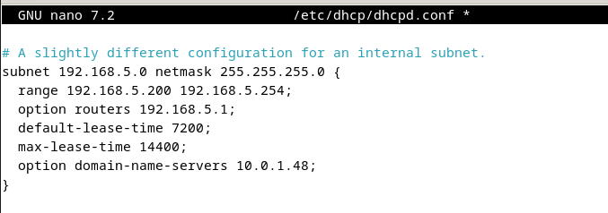

Repartirá IPs de la `192.168.5.200 a la 192.168.5.254`.  
Le he puesto el DNS del instituto y la IP del router como gateaway.

>En mi caso no hay colisión de direcciones porque el rango que he puesto no interfiere con nada.  
Si así fuese, en el mismo `dhcpd.conf` hay una opcion para excluir IPs:

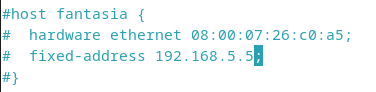

<br><br>

## **Paso 4: Habilitar el servidor DHCP**
---
Para habilitar el servidor DHCP ejecuté el siguiente comando:

```
sudo systemctl enable isc-dhcp-server
```

>`systemctl` es un comando que sirve para iniciar, detener o activar servicios

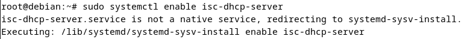

<br><br>

## **Paso 5: Iniciar el servidor DHCP**
---
Luego, inicio el servidor DHCP con este otro comando:

```
sudo systemctl start isc-dhcp-server
```

### Como a mí no me funcionaba, hice uso del `journalctl` y me dijo exactamente donde tenía el error:

```
journalctl -u isc-dhcp-server
```
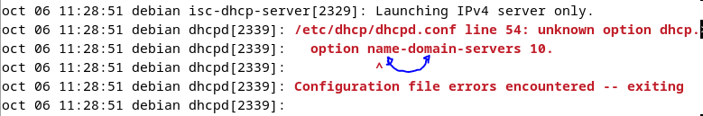

Una vez solucionado esto:


<br><br>

## **Paso 6: Verificar el estado del servidor DHCP**
---
Verifico el estado del servidor DHCP para asegurarte de que esté funcionando correctamente con el siguiente comando:

```
sudo systemctl status isc-dhcp-server
```

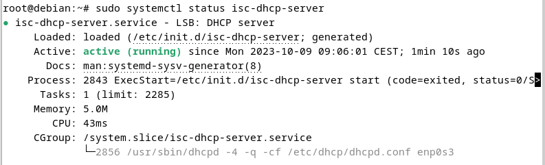

Ya sale que está activo el servicio.

<br><br>

## **Paso 7: Comprobar si funciona**
---
Para comprobar si la configuración ha sido efectiva, voy a encender una equipo en esa red, configurado para obtener una configuración de **red automática**...

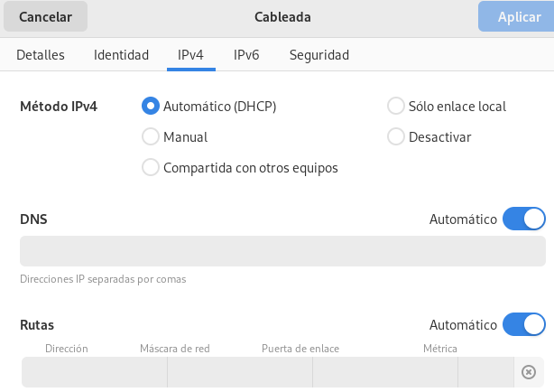 

Reinicio...

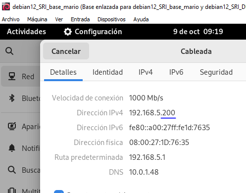


Ahora probare con otro equipo...

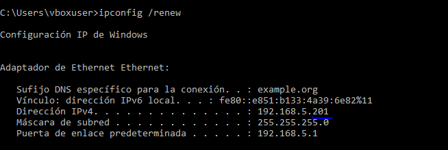

### Se puede ver que todo cuadra bien.